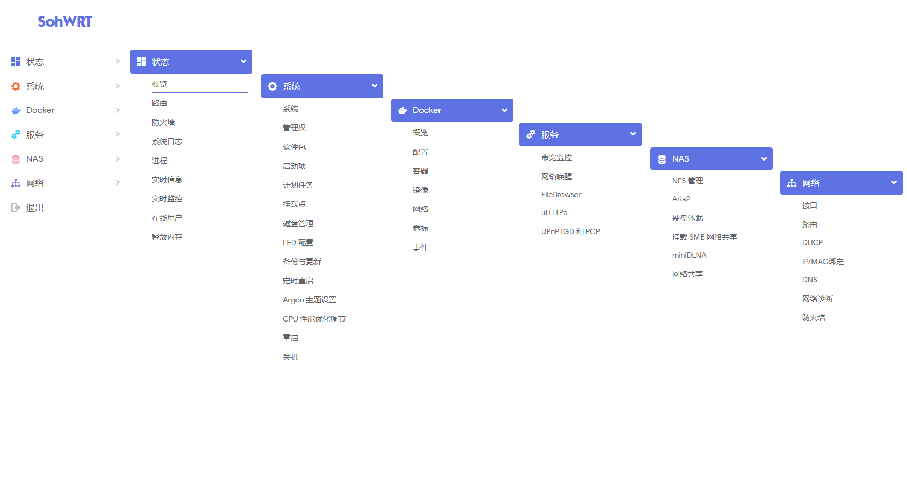

<div align="center">

<h1>SohWrt — 自用 OpenWrt / ImmortalWrt 旁路由固件</h1>

[](#readme) [](#项目说明-) [](#固件特色-) [](#固件下载-) [](#插件预览-) [](#定制固件-) [](#特别提示-) [](#鸣谢-)
</div>


## 项目说明 [](#项目说明-)
- 固件构成：[](https://github.com/coolsnowwolf/lede) [](https://github.com/immortalwrt/immortalwrt) [](https://github.com/P3TERX/Actions-OpenWrt) [](https://github.com/unifreq/openwrt_packit) [](https://github.com/haiibo/OpenWrt)
- 项目使用 GitHub Actions 基于两条源码线进行云编译：
  - [Lean](https://github.com/coolsnowwolf/lede) 的 LEDE（OpenWrt）源码，包管理器为 opkg，插件包格式为 ipk
  - [ImmortalWrt](https://github.com/immortalwrt/immortalwrt) 的 openwrt-25.12 分支，包管理器为 apk，插件包格式为 apk
- 固件默认管理地址：`192.168.0.200` 默认用户：`root` 默认密码：`password`
- 提供适配于 X86、友善 R5S、电犀牛 R66S 的 LEDE 与 ImmortalWrt 固件
- 固件集成的所有插件包（ipk / apk）全部打包在 Packages 文件中，可以在 [Releases](https://github.com/columbine2k/OpenWrt/releases) 内进行下载
- 项目编译的固件插件为最新版本，最新版插件可能有 BUG，如果之前使用稳定则无需追新
- 第一次使用请采用全新安装，避免出现升级失败以及其他一些可能的 BUG


## 仓库结构 [](#仓库结构-)
- `lede/`：LEDE 源码线的定制脚本（diy.sh）、编译配置（configs/）与补丁（patches/）、专属 rootfs 文件（rootfs/）
- `immortalwrt/`：ImmortalWrt 源码线的定制脚本（diy.sh）、编译配置（configs/）与补丁（patches/）
- `shared/`：两条源码线共用的追加配置（extra.config）与包补丁（package-patches/）
- `files/`：共享 rootfs 覆盖文件（首次开机脚本、终端预设等）
- `scripts/`：构建时动作脚本（如终端工具预设）
- `.github/workflows/`：四条独立构建 workflow（源码线 × 平台）


## 固件特色 [](#固件特色-)
1. 固件每天定时自动编译，以确保获得最新体验
2. 集成 Docker 与 Docker Compose 服务
3. 为旁路由优化设置


## 固件下载 [](#固件下载-)
点击下表中 [](https://github.com/columbine2k/OpenWrt/releases) 即可跳转到该设备固件下载页面
| 平台+设备名称 | 固件编译状态 | 配置文件 | 固件下载 |
| :-------------: | :-------------: | :-------------: | :-------------: |
| [](https://github.com/columbine2k/OpenWrt/blob/main/.github/workflows/lede-x86_64.yml) | [](https://github.com/columbine2k/OpenWrt/actions/workflows/lede-x86_64.yml) | [](https://github.com/columbine2k/OpenWrt/blob/main/lede/configs/x86_64.config) | [](https://github.com/columbine2k/OpenWrt/releases/tag/X86_64) |
| [](https://github.com/columbine2k/OpenWrt/blob/main/.github/workflows/lede-rockchip.yml) | [](https://github.com/columbine2k/OpenWrt/actions/workflows/lede-rockchip.yml) | [](https://github.com/columbine2k/OpenWrt/blob/main/lede/configs/rockchip.config) | [](https://github.com/columbine2k/OpenWrt/releases/tag/Rockchip) |
| [](https://github.com/columbine2k/OpenWrt/blob/main/.github/workflows/immortalwrt-x86_64.yml) | [](https://github.com/columbine2k/OpenWrt/actions/workflows/immortalwrt-x86_64.yml) | [](https://github.com/columbine2k/OpenWrt/blob/main/immortalwrt/configs/x86_64.config) | [](https://github.com/columbine2k/OpenWrt/releases/tag/X86_64-ImmortalWrt) |
| [](https://github.com/columbine2k/OpenWrt/blob/main/.github/workflows/immortalwrt-rockchip.yml) | [](https://github.com/columbine2k/OpenWrt/actions/workflows/immortalwrt-rockchip.yml) | [](https://github.com/columbine2k/OpenWrt/blob/main/immortalwrt/configs/rockchip.config) | [](https://github.com/columbine2k/OpenWrt/releases/tag/Rockchip-ImmortalWrt) |


## 插件预览 [](#插件预览-)



## 定制固件 [](#定制固件-)
1. 首先要登录 GitHub 账号，然后 Fork 此项目到你自己的 GitHub 仓库
2. 修改对应源码线的配置文件添加或删除插件：LEDE 在 `lede/configs/`，ImmortalWrt 在 `immortalwrt/configs/`，也可以上传自己的 `xx.config` 覆盖对应文件
3. 插件对应名称及功能请参考恩山网友帖子：[Applications 添加插件应用说明](https://www.right.com.cn/forum/thread-3682029-1-1.html)
4. 如需修改默认 IP、添加或删除插件包以及一些其他设置，请在对应源码线的定制脚本内修改：`lede/diy.sh` 或 `immortalwrt/diy.sh`
5. 两条源码线共用的追加配置为 `shared/extra.config`，共享 rootfs 文件放在 `files/` 目录
6. 修改对应 `.github/workflows/` 下的 workflow 文件，点击 `Actions` 运行要编译的 workflow 即可开始编译
7. 编译大概需要3-5小时，编译完成后在仓库主页 [Releases](https://github.com/columbine2k/OpenWrt/releases) 对应 Tag 标签内下载固件
<details>
<summary><b>&nbsp;如果你觉得修改 config 文件麻烦，那么你可以点击此处尝试本地提取</b></summary>

1. 首先装好 Linux 系统，推荐 Debian 11 或 Ubuntu LTS

2. 安装编译依赖环境

   ```bash
   sudo apt update -y
   sudo apt full-upgrade -y
   sudo apt install -y ack antlr3 asciidoc autoconf automake autopoint binutils bison build-essential \
   bzip2 ccache cmake cpio curl device-tree-compiler fastjar flex gawk gettext gcc-multilib g++-multilib \
   git gperf haveged help2man intltool libc6-dev-i386 libelf-dev libglib2.0-dev libgmp3-dev libltdl-dev \
   libmpc-dev libmpfr-dev libncurses5-dev libncursesw5-dev libreadline-dev libssl-dev libtool lrzsz \
   mkisofs msmtp nano ninja-build p7zip p7zip-full patch pkgconf python2.7 python3 python3-pyelftools \
   libpython3-dev qemu-utils rsync scons squashfs-tools subversion swig texinfo uglifyjs upx-ucl unzip \
   vim wget xmlto xxd zlib1g-dev
   ```

3. 下载源代码，更新 feeds 并安装到本地

   ```bash
   git clone https://github.com/coolsnowwolf/lede
   cd lede
   ./scripts/feeds update -a
   ./scripts/feeds install -a
   ```

4. 复制 `lede/diy.sh`（LEDE）或 `immortalwrt/diy.sh`（ImmortalWrt）文件内所有内容到命令行，添加自定义插件和自定义设置

5. 命令行输入 `make menuconfig` 选择配置，选好配置后导出差异部分到 seed.config 文件

   ```bash
   make defconfig
   ./scripts/diffconfig.sh > seed.config
   ```

6. 命令行输入 `cat seed.config` 查看这个文件，也可以用文本编辑器打开

7. 复制 seed.config 文件内所有内容到 `lede/configs/` 或 `immortalwrt/configs/` 目录对应文件中覆盖就可以了

   **如果看不懂编译界面可以参考 YouTube 视频：[软路由固件 OpenWrt 编译界面设置](https://www.youtube.com/watch?v=jEE_J6-4E3Y&list=WL&index=7)**
</details>


## 特别提示 [](#特别提示-)

- **因精力有限不提供任何技术支持和教程等相关问题解答，不保证完全无 BUG！**

- **本人不对任何人因使用本固件所遭受的任何理论或实际的损失承担责任！**

- **本固件禁止用于任何商业用途，请务必严格遵守国家互联网使用相关法律规定！**


## 鸣谢 [](#鸣谢-)
| [ImmortalWrt](https://github.com/immortalwrt) | [coolsnowwolf](https://github.com/coolsnowwolf) | [P3TERX](https://github.com/P3TERX) | [Flippy](https://github.com/unifreq) |
| :-------------: | :-------------: | :-------------: | :-------------: |
|  |  |  |  |
| [Ophub](https://github.com/ophub) | [SuLingGG](https://github.com/SuLingGG) | [QiuSimons](https://github.com/QiuSimons) | [IvanSolis1989](https://github.com/IvanSolis1989) |
|  |  |  |  |


<a href="#readme">

</a>
